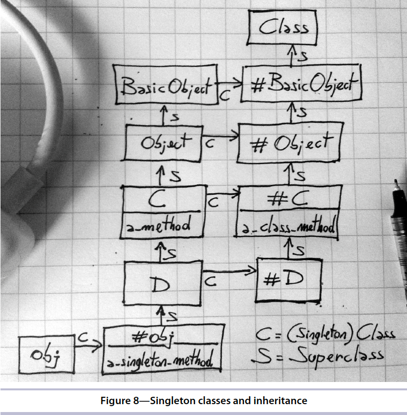

# Chapter 5: Class Definitions

- The class itself takes the role of the current object `self`

## The Current Class

- In Ruby, you always have a current object: `self` and a `current class (module)`. When you define a method, that method becomes an instance method of the current class.

  - At the top level of your program, the current object is Object, the class is `main`
  - In a method, the current class is the class of the current object
  - When you open a class with class keyword (or a module with the module keyword), that class becomes the current class

- Use `Module#class_eval` or `Module#module_eval` evaluates a block in the context of an existing class

```ruby
def add_method_to(a_class)
  a_class.class_eval do
    def my_method
      'Hello!'
    end
  end
end

add_method_to String
p 'abc'.my_method
```

- `Module#class_eval` is very different from `BasicObject.instance_eval`, `instance_eval` only changes `self` and use to open an object of a class, while `class_eval` change both `self` and `current class` ans use to open class definition and define methods with `def`. So all method define with `def` become instance methods of the current class
- You can use `module_exec/class_exec` to pass extra parameters to the block
- In class definition, the current object `self` and the current class are the same - the class being defined

## Class instance variables

- The Ruby interpreter assumes that all instance variables belong to the current object `self`
- In a class definition, the role of `self` belongs to the class itself, so the instance variables belong to the class

```ruby
class MyClass
  @my_var = 1  # => Class Instance Variable

  def self.read
    p @my_var
  end

  def write
    p "Write"
    @my_var = 2 # => Object Instance Variable
  end

  def read
    p @my_var
  end
end

obj = MyClass.new
obj.read # => nil
obj.write
obj.read # => 2
MyClass.read # => 1
```

- Class variables are different from Class Instance Variables because they can be accessed by subclasses and by regular instance methods

```ruby
@@v = 0

class C
  @@v = 1
end

class D < C
  def my_method
    @@v # => 1
    @@v = 2
  end
end

@@v = 2
```

- Class variables don't really belong to classes, they belong to class hierarchies. Above example, `@@v` is defined in the context of `main`, so it belong to main's class Object and belong to all the descendants of `Object`. `MyClass` inherits from `Object`, so it ends up sharing the same class variables

## Singleton methods

- Singleton method is a method that's specific to a single object. It means that the method is added to a single object

```ruby
str = 'Hello world'

def str.title?
  upcase == self
end

p str.title? # => title is a singleton method of str object
p str.methods.grep(/title?/)
p str.singleton_methods

```

- We also can define a class that contains a instance method called `title?` but every instance is created by using this class will have `title?` method. By using Singleton method, there's just `str` object has `title?` method, no other object gets the method
- By using singleton method, you can avoid creating a class to define `title?` method

## Class Marcos

- All the `attr_*` methods are defined on class Module, so you can use them whenever self is a module or a class. A method such as `attr_accessor` is called a Class Macro. They are just regular class methods

```ruby
class MyClass
  attr_accessor :a
end

obj = MyClass.new
obj.a = 2
p obj.a
```

- `attr_accessor` is used to generate attributes for the object, it generates both `Module#attr_reader` and `Module#attr_writer` getter

## Singleton Classes

- Object has its own special hidden class called **singleton class** of the object
- Singleton classes have only a single instance and they can't be inherited
- A singleton class is where an object's Singleton Methods live

```ruby
an_object = Object.new

singleton_class = class << an_object
  self
end

def an_object.my_singleton_method; end

p singleton_class.class # => Class
p singleton_class.singleton_class # => #<Class:#<Class:#<Object:0x00007fe8e78a3630>>> (hidden class)
p singleton_class.singleton_class.ancestors # => [#<Class:#<Class:#<Object:0x00007fe8e78a3630>>>, #<Class:Object>, #<Class:BasicObject>, Class, Module, Object, Kernel, BasicObject]
p singleton_class.instance_methods.grep(/my_/) # => [:my_singleton_method]

```

- If an object has a singleton class, Ruby starts looking for methods in the singleton class rather than the conventional class, and that’s why you can call Singleton Methods such as `obj#a_singleton_method`. If Ruby can’t find the method in the singleton class, then it goes up the ancestors chain, ending in the superclass of the singleton class—which is the object’s class.

- The superclass of the singleton class is the singleton class of the superclass. It’s easy (see the code and image below)

```ruby
class C
  class << self # => used to include the singleton class of C
    def a_class_method
      'C.a_class_method()'
    end
  end
end

class D < C; end

obj = D.new
obj.a_class_method

p C.singleton_class # => #<Class:C>
p D.singleton_class # => #<Class:D>
p D.singleton_class.superclass # => #<Class:C>
p C.singleton_class.superclass # => #<Class:Object>

```



- Ruby object model is a beautiful place. There are classes, singleton classes, and modules. There are instance methods, class methods and Singleton methods. But it looks very complex at the first glance. There are 7 rules of the Ruby object model

  1. There is only one kind of object it's a regular object or a module.
  2. There is only one kind of module it's a regular module, a class, or a singleton class.
  3. There is only one kind of method, and it lives in a module—most often in a class (`Class` is a subclass of `Module`).
  4. Every object, classes included, has its own “real class,” be it a regular class or a singleton class.
  5. Every class, with the exception of BasicObject, has exactly one ancestor — either a superclass or a module. This means you have a single chain of ancestors from any class up to BasicObject.
  6. The superclass of the singleton class of an object is the object’s class. The superclass of the singleton class of a class is the singleton class of the class’s superclass.
  7. When you call a method, Ruby goes “right” in the receiver’s real class and then “up” the ancestors chain. That’s all there is to know about the way Ruby finds methods.

## Techniques with singleton methods and singleton classes

### Class extension

```ruby
module MyModule
  def self.my_method
    'hello'
  end
end

class MyClass
  include MyModule
end

p MyClass.my_method # => undefined method `my_method' for MyClass:Class (NoMethodError)

```

- `MyClass.my_method` return an errors because when a class includes a module, it gets the module's instance methods, not the class methods
- Solution
  - `my_method` is an instance method of the singleton class of MyClass. Class methods are just a special case on Singleton Methods. As such, it is also a class method of MyClass. This technique is called a `Class Extension`

```ruby
module MyModule
  def my_method
    'hello'
  end
end

class MyClass
  class << self # => include the singleton class of MyClass
    include MyModule
  end
end

p MyClass.my_method # => "hello"
```

### Object extension

- Use the same technique as `Class Extension`

```ruby
module MyModule
  def my_method
    'hello'
  end
end

obj = Object.new

class << obj
  include MyModule
end

p obj.my_method # => "hello"
p obj.singleton_method # => [:my_method]
```

### Object#extend

```ruby
module MyModule
  def my_method
    'hello'
  end
end

obj = Object.new
obj.extend MyModule
p obj.my_method # => "hello"

class MyClass
  class << self
    include MyModule
  end
end

p MyClass.my_method # => "hello"
```

### Around Aliases

- User `Module#alias_method` to wrap a method instead of modify directly

```ruby
module MyModule
  alias :m1, :my_method

  def my_method
    'hello'
  end
  alias_method :m, :my_method
end

obj = Object.new

p MyClass2.my_method # => "hello"
p MyClass2.m # => "hello"
```
